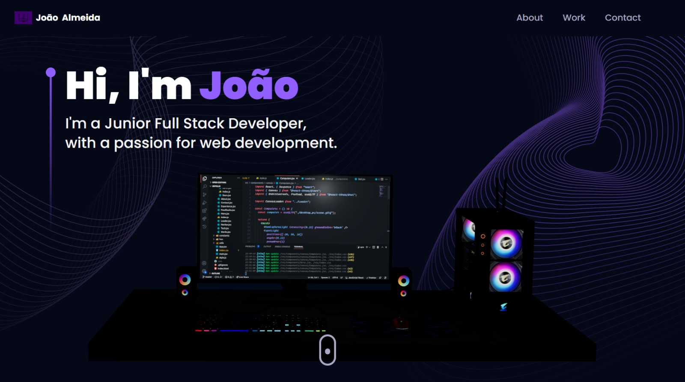

# My 3D Portfolio

 <!-- Replace with actual screenshot -->

Welcome to my personal portfolio website! This project showcases my abilities and creativity as a developer, offering an interactive, 3D-driven experience. Crafted with the latest web technologies, it blends captivating 3D visuals, seamless animations, and a responsive layout that ensures a smooth experience across all devices. Take a look at my journey, explore my projects, and learn about my skills—enjoy the exploration!

---

## Overview

This portfolio is a dynamic, engaging platform that reflects my passion for development. Inspired by cutting-edge web design, it uses 3D visuals and animations to create a unique, memorable user experience.

---

## Tech Stack


- **Front-End**:
  - **React.js**: For a modular, reusable component structure.
  - **React Router**: Smooth navigation between pages.
  - **JavaScript (ES6+)**: Modern, clean code.

- **3D Graphics & Animations**:
  - **Three.js**: Handles the 3D rendering.
  - **React Three Fiber**: Makes 3D scenes declarative and React-friendly.
  - **Framer Motion**: Adds smooth, interactive animations.

- **Styling & Performance**:
  - **Tailwind CSS**: Utility-first CSS for fast, responsive styling.
  - **Vite**: Lightning-fast build tool for development and production.

- **Functionality**:
  - **EmailJS**: Powers the contact form.
  - **React Vertical Timeline**: Displays my experience and education.
  - **React Parallax Tilt**: Adds subtle depth effects.

---

## Design Highlights


- **3D Hero Section**: An eye-catching intro with animated 3D elements.
- **Skills Display**: 3D visuals highlighting my technical expertise.
- **Interactive Timeline**: A scrollable journey through my background.
- **Project Showcase**: Clean cards with project details and links.
- **Contact Page**: A 3D Earth model alongside a functional form.
- **Responsive Layout**: Perfectly adapts to any screen size.

---


## ⚠️ Difficulties Faced


- **Adding Motions**: Implementing animations using Framer Motion was challenging at first. Achieving the right timing and fluidity required some trial and error, but it taught me valuable lessons on how to enhance user experience through motion.
- **3D Scene Setup**: Working with 3D scenes in React Three Fiber was a whole new challenge for me. Positioning elements, fine-tuning lighting, and syncing everything with the UI was tricky at the start, but I improved with hands-on practice.
- **First Time with Tailwind CSS**: As someone new to Tailwind, I encountered a slight learning curve with utility-first classes. However, I quickly grasped its concepts, found it very intuitive, and now appreciate how it simplifies the styling process.


---

## Setup Instructions

Want to run this project locally? Here’s how:

1. **Clone the repository**:
   ```bash
   git clone https://github.com/AimTheSun/portofolio-website-3d.git
   ```

2. **Navigate to the directory**:
   ```bash
   cd portofolio-website-3d
   ```

3. **Install dependencies**:
   ```bash
   npm install
   ```

4. **Start the development server**:
   ```bash
   npm run dev
   ```

5. Open your browser and go to `http://localhost:3000` (or the port Vite specifies).

---
Feel free to explore, fork, or reach out! I’d love to hear your thoughts via the contact form on the site. Thanks for checking it out! 
